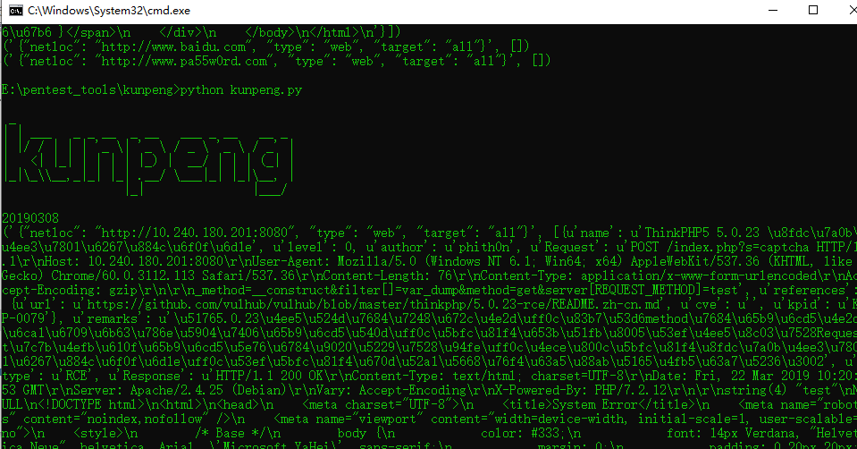

# 开源POC检测框架Kunpeng使用_Python3

## 0x00 简介

项目地址：[https://github.com/opensec-cn/kunpeng](https://github.com/opensec-cn/kunpeng)

Kunpeng是一个Golang编写的开源POC检测框架，集成了包括数据库、中间件、web组件、cms等等的漏洞POC（查看已收录POC列表），可检测弱口令、SQL注入、XSS、RCE等漏洞类型，以动态链接库的形式提供调用，通过此项目可快速对目标进行安全漏洞检测，比攻击者快一步发现风险漏洞。
<!-- more -->
运行环境：Windows，Linux，Darwin

工作形态：动态链接库，so、dll、dylib、go plugin

## 0x01 使用

环境:
```
windows10
python3.7
kunpeng_c.dll //动态链接库请到kunpeng项目下载最新的
```
```python
# coding:utf-8

import sys
import time
import json
from ctypes import *
import threading


def _args_encode(args_string):
    '''Encode by utf-8 in PY3.'''
    if sys.version_info >= (3, 0):
        args_string = args_string.encode('utf-8')
    return args_string


# 加载动态连接库
kunpeng = cdll.LoadLibrary('./kunpeng_c.dll')

# 定义出入参变量类型
kunpeng.GetPlugins.restype = c_char_p
kunpeng.Check.argtypes = [c_char_p]
kunpeng.Check.restype = c_char_p
kunpeng.SetConfig.argtypes = [c_char_p]
kunpeng.GetVersion.restype = c_char_p

print(kunpeng.GetVersion())

# 获取插件信息
out = kunpeng.GetPlugins()
# print(out)

# 修改配置
config = {
    'timeout': 10,
    # 'aider': 'http://xxxx:8080', # 漏洞辅助验证接口，部分漏洞无法通过回显判断是否存在漏洞，可通过辅助验证接口进行判断。python -c'import socket,base64;exec(base64.b64decode("aGlzdG9yeSA9IFtdCndlYiA9IHNvY2tldC5zb2NrZXQoc29ja2V0LkFGX0lORVQsc29ja2V0LlNPQ0tfU1RSRUFNKQp3ZWIuYmluZCgoJzAuMC4wLjAnLDgwODgpKQp3ZWIubGlzdGVuKDEwKQp3aGlsZSBUcnVlOgogICAgdHJ5OgogICAgICAgIGNvbm4sYWRkciA9IHdlYi5hY2NlcHQoKQogICAgICAgIGRhdGEgPSBjb25uLnJlY3YoNDA5NikKICAgICAgICByZXFfbGluZSA9IGRhdGEuc3BsaXQoIlxyXG4iKVswXQogICAgICAgIGFjdGlvbiA9IHJlcV9saW5lLnNwbGl0KClbMV0uc3BsaXQoJy8nKVsxXQogICAgICAgIHJhbmtfc3RyID0gcmVxX2xpbmUuc3BsaXQoKVsxXS5zcGxpdCgnLycpWzJdCiAgICAgICAgaHRtbCA9ICJORVcwMCIKICAgICAgICBpZiBhY3Rpb24gPT0gImFkZCI6CiAgICAgICAgICAgIGhpc3RvcnkuYXBwZW5kKHJhbmtfc3RyKQogICAgICAgICAgICBwcmludCAiYWRkIityYW5rX3N0cgogICAgICAgIGVsaWYgYWN0aW9uID09ICJjaGVjayI6CiAgICAgICAgICAgIHByaW50ICJjaGVjayIrcmFua19zdHIKICAgICAgICAgICAgaWYgcmFua19zdHIgaW4gaGlzdG9yeToKICAgICAgICAgICAgICAgIGh0bWw9IlZVTDAwIgogICAgICAgICAgICAgICAgaGlzdG9yeS5yZW1vdmUocmFua19zdHIpCiAgICAgICAgcmF3ID0gIkhUVFAvMS4wIDIwMCBPS1xyXG5Db250ZW50LVR5cGU6IGFwcGxpY2F0aW9uL2pzb247IGNoYXJzZXQ9dXRmLThcclxuQ29udGVudC1MZW5ndGg6ICVkXHJcbkNvbm5lY3Rpb246IGNsb3NlXHJcblxyXG4lcyIgJShsZW4oaHRtbCksaHRtbCkKICAgICAgICBjb25uLnNlbmQocmF3KQogICAgICAgIGNvbm4uY2xvc2UoKQogICAgZXhjZXB0OnBhc3M="))' 在辅助验证机器上运行以上代码，填入http://IP:8088，不开启则留空。
    # 'http_proxy': 'http://xxxxx:1080',
    # 'pass_list':['xtest'] // 默认密码字典，不定义则使用硬编码在代码里的小字典
    # 'extra_plugin_path': '/home/test/plugin/', //除已编译好的插件（Go、JSON）外，可指定额外插件目录（仅支持JSON插件），指定后程序会周期读取加载插件
}

conf_args = json.dumps(config)
kunpeng.SetConfig(_args_encode(conf_args))

# 开启日志打印
# kunpeng.ShowLog()

def callback():
    a = task
    # print(a)
    out = kunpeng.Check(task)
    print(a, json.loads(out))
    # print(a)

# 扫描目标
# with open("ip.txt") as fp:
with open("url.txt") as fp:hexo
    for item in fp.readlines():
        # print(item)
        task = {
            'type': 'web',  # 目标类型web或者service
            # 'type': 'service',
            'netloc': item.strip(), 
            'target': 'all'
        #     "meta":{
        #     "system": "windows",  //操作系统，部分漏洞检测方法不同系统存在差异，提供给插件进行判断
        #     "pathlist":[], //目录路径URL列表，部分插件需要此类信息，例如列目录漏洞插件
        #     "filelist":[], //文件路径URL列表，部分插件需要此类信息，例如struts2漏洞相关插件
        #     "passlist":[] //自定义密码字典
        # } // 非必填
        }

        # print(task)
        task = _args_encode(json.dumps(task))
        t1 = threading.Thread(target=callback)
        
        t1.start()  
```
url列表放到url.txt下面，开启了多线程

扫描结果

